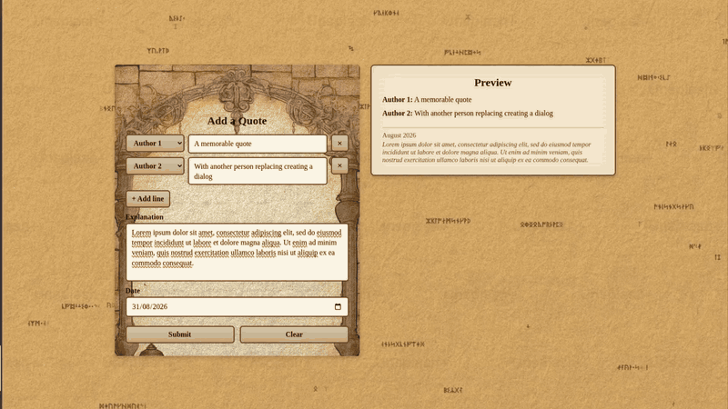

# Discord Quote Bot

[](LICENSE)

## Introduction
The project was supposed to be a simple pet project to just keep memorable quotes of friends and then it escalated a bit.
What started as a single script dumping text into a Discord channel turned into a bot with slash commands, self
downloading fonts, auto generated "quote of the day" images, a SQLite database behind an ORM and a whole React web
front for submitting and moderating quotes. Basically a full stack app for something that could have stayed a text
file, mostly because I wanted an excuse to poke at a few technologies I hadn't used before.

## Features

- Discord slash commands
  - `/quote` - generates and posts a "quote of the day" style image
  - `/explain` - gives the "lore" behind the last posted quote
  - `/submit` - points you to the web front to submit your own
- Auto generated quote images (Pillow) with fonts that download and verify themselves on first run
- Web front UI (React + Vite)
  - Submitting new quotes
  - Quote management (approving/discarding nominations, role gated with `user`/`master` login)
- Self creating SQLite database, no manual setup required

## Screenshots

Adding a new quote:



## TODO List

- ~~Make database self creatable without prerequisites~~
- ~~Migrate whole app config to environment variables~~
- Adding Authors (with colours and signatures) via web front
- Optimise font handling and caching
- Finalise testing suite
  - ~~app config~~ 
  - database connection (partially done)
  - image generation
  - backend api
  - whole deployment

## Usage

Firstly, why would you, there is surely a better option somewhere out there. Secondly the project was hand-tailored to
some personal use cases that may be odd for other users, the whole thing was built for one specific Discord server, so
some of the slash command names and descriptions are still in Polish. Thirdly it is just a pet project, updates are
spontaneous and bugs are likely to be present after big updates.

If none of that scared you off and you still want to run it for your own server, the Setup section below should get
you there, just expect to rename/translate a few strings to your own taste.

### Prerequisites

- Python 3.12+
- Node.js + npm (for the web front)
- nginx (or anything else that can reverse proxy `/api` to the backend and serve the built front, see [Tying it together](#tying-it-together) below)
- A Discord bot application and its token

### Setup

#### Bot / backend

1. Clone the repo and go into it
2. Create a venv and install the deps
   ```
   python -m venv .venv
   source .venv/bin/activate
   pip install -r requirements.txt
   ```
3. Create a `.env` file in the project root with the following (see [Environment variables](#environment-variables) below):
   ```
   BOT_TOKEN=
   SECRET_KEY=
   USER_PASS=
   MASTER_PASS=
   LOCAL_ADDRESS=
   LOCAL_PORT=
   SITE_URL=
   ```
4. Run it
   ```
   python bot.py
   ```
   Fonts get downloaded automatically on first run, and the database file gets created automatically too, so there is nothing else to prepare.

#### Web front

1. `cd front`
2. `npm install`
3. `npm run build` to produce `front/dist`

The front talks to the backend through same-origin `/api/...` calls, so it expects something in front of it doing the routing rather than hitting the backend directly - see below.

#### Tying it together

Both `/quotes/...`, `/authors`, `/login`, etc. from the backend and the built front need to be served from the same origin under `/` and `/api/`. An example nginx config for that is in [`deploy/nginx.conf.example`](deploy/nginx.conf.example) - point its `root` at your `front/dist` and it'll proxy `/api/` to the bot's `LOCAL_ADDRESS:LOCAL_PORT`. Without a proxy in front of it (nginx or otherwise), the web front can't reach the backend, `npm run dev` included.

If you're already on a tailnet, `tailscale serve` can do this same job instead of nginx, no separate proxy needed:

```
tailscale serve --set-path=/api --bg http://127.0.0.1:8000
tailscale serve --set-path=/    --bg /path/to/front/dist
```

Both mount points stay active on the same hostname at once, `tailscale serve` strips the `/api` prefix before forwarding just like the nginx config does (so `/api/login` reaches the bot as `/login`), and you get HTTPS for free. Two things it won't do for you though: the extra security headers (HSTS, `X-Frame-Options`, etc.) the example nginx config sets, and a custom domain - by default it's reachable at `https://<device>.<tailnet>.ts.net` to your tailnet, or to the whole internet if you turn on [Funnel](https://tailscale.com/kb/1223/funnel).

### Environment variables

| Variable        | Description                                                         |
|-----------------|---------------------------------------------------------------------|
| `BOT_TOKEN`     | Your Discord bot token                                              |
| `SECRET_KEY`    | Secret used to sign the JWT tokens for the web front login          |
| `USER_PASS`     | Password for the `user` role (can submit nominations)               |
| `MASTER_PASS`   | Password for the `master` role (can also approve/discard quotes)    |
| `LOCAL_ADDRESS` | Address the backend (aiohttp) server binds to, e.g. `127.0.0.1`     |
| `LOCAL_PORT`    | Port the backend server binds to, e.g. `8000`                       |
| `SITE_URL`      | Public URL of the web front, sent to users by the `/submit` command |
| `DB_PATH`       | Optional, path to the sqlite database, defaults to `quotes.db`      |

## Nice to have
- own domain (or just relying on `tailscale serve`/Funnel, see the note in [Tying it together](#tying-it-together) it can fully replace nginx here)

## License

MIT, do whatever you want with it.
